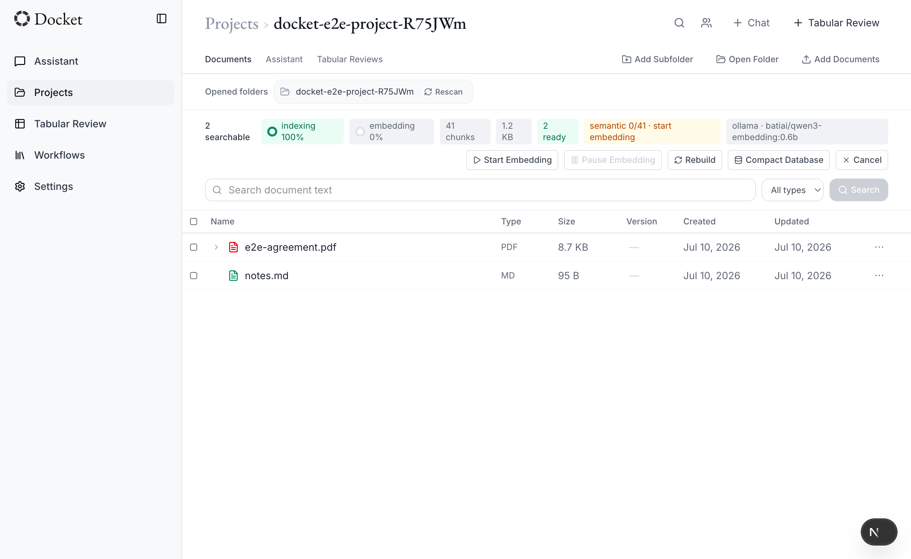
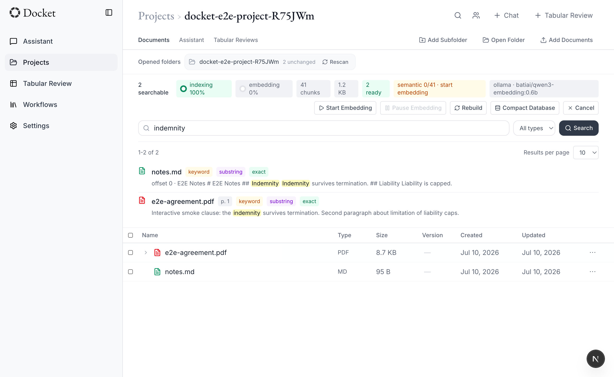
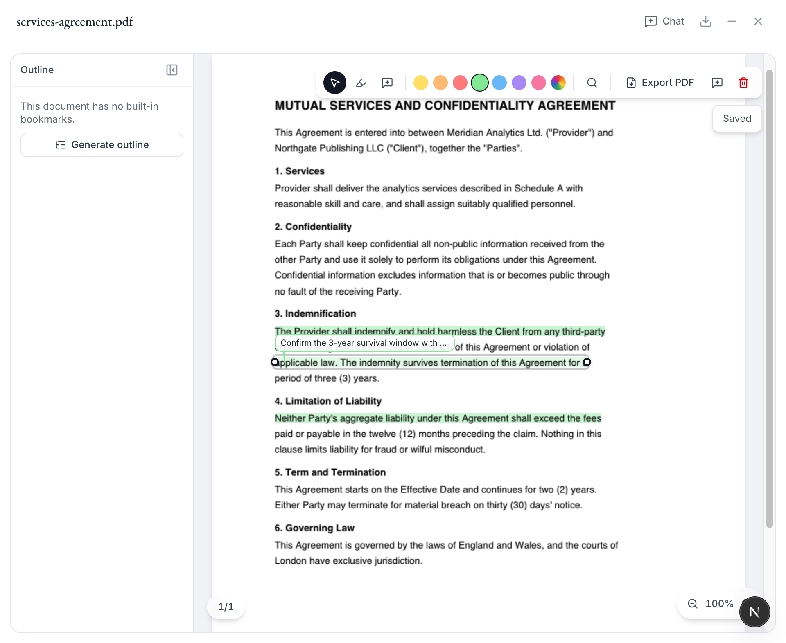
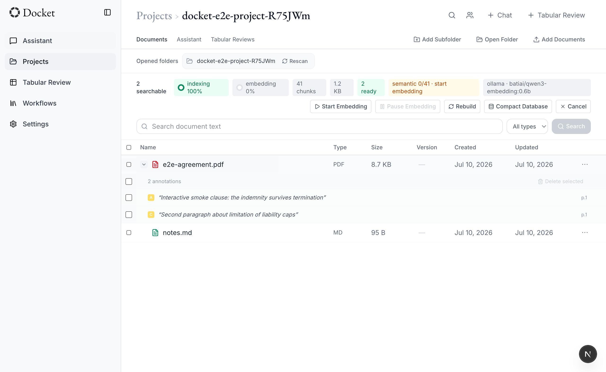
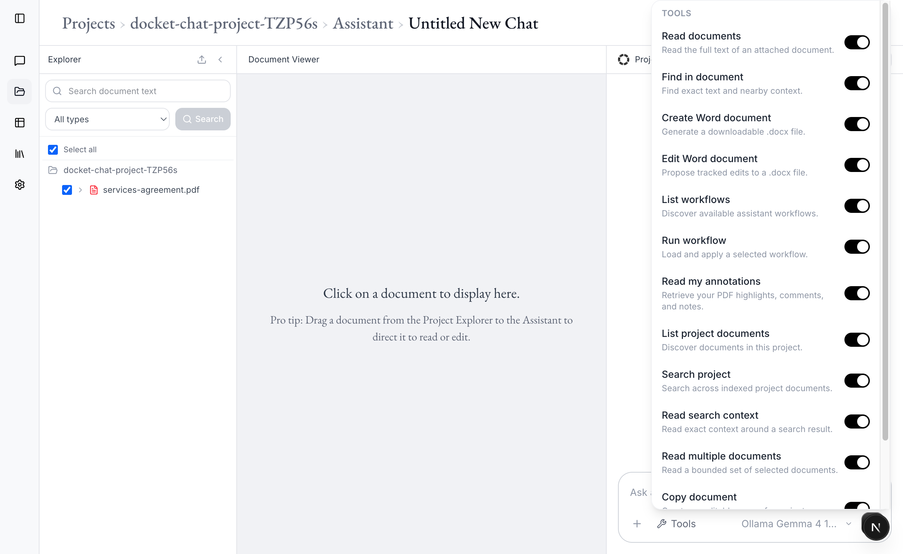
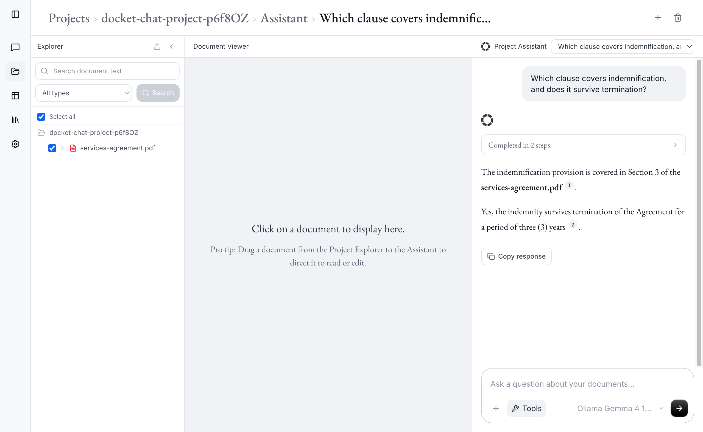

# Docket

Docket is a local desktop AI legal platform. Documents, database,
settings, indexing, search, and OCR stay on your computer. No Supabase,
no cloud storage, no external login. Network calls are limited to model
providers you explicitly configure for chat or embeddings; local Ollama
and MLX/OpenAI-compatible servers can keep those workflows offline too.

Docket builds on
[mikelocal](https://github.com/rafal-fryc/mikelocal), the Electron
desktop edition of [Mike](https://github.com/Open-Legal-Products/mike),
the open-source AI legal platform. See
[License & attribution](#license--attribution) for provenance and
licensing details.

Docket extends that desktop base with self-contained local project
folders (app-level state under Electron `userData`, project data under
each project's `.docket/` directory), hybrid document indexing and
search with optional embeddings, local OCR for scanned PDFs and images,
a full PDF annotation workflow
(highlights, comments, citation promotion, PDF export), annotation- and
document-scoped chat, and a bundled-LibreOffice installer — see
the feature overview below.

The original Next.js + Express architecture is preserved; an Electron
shell starts a local desktop session, then lets you open or create local
folder-backed projects.

---

<!-- DEMO SECTION — uncomment once the clips are uploaded.
     How to get a video URL GitHub renders inline: open any issue or PR
     comment box on github.com, drag the .mp4 in, wait for upload, and
     copy the generated https://github.com/user-attachments/assets/…
     URL (no need to post the comment). A bare URL on its own line
     renders as an inline player in the README.

## Demo

Short clips of the main workflows, recorded with sample public
documents (no real client data).

### Hybrid search (keyword + semantic)

https://github.com/user-attachments/assets/PLACEHOLDER-search

### PDF annotations, citation promotion, and annotated export

https://github.com/user-attachments/assets/PLACEHOLDER-annotations

### Document-scoped chat with a local model

https://github.com/user-attachments/assets/PLACEHOLDER-chat

### Tabular review

https://github.com/user-attachments/assets/PLACEHOLDER-tabular

---
-->

## Table of contents

1. [New in Docket](#new-in-docket)
2. [Using the app](#using-the-app)
3. [Features](#features)
4. [Requirements by feature](#requirements-by-feature)
5. [Architecture](#architecture)
6. [Security model](#security-model)
7. [Data layout](#data-layout)
8. [Building from source](#building-from-source)
9. [Project layout](#project-layout)
10. [Tech stack](#tech-stack)
11. [Known limitations](#known-limitations)
12. [License](#license)

---

## New in Docket

Docket's additions on top of the mikelocal desktop base. Every
screenshot below is captured from the app's automated E2E harness
against synthetic fixture documents — no real files.

### Hybrid document indexing and search

A project-local hybrid index: SQLite FTS5 `unicode61` lexical search
plus a trigram index for substring/Korean-CJK recall, optional
configurable embedding providers (Ollama and OpenAI-compatible
endpoints, including local MLX servers) with Float32 vector rows, a
resumable background embedding queue, and RRF-merged, document-grouped
results with visible match reasons (`backend/src/lib/indexing/`).



Search results show *why* each document matched — keyword, substring,
exact, or semantic — with highlighted snippets:



### Local OCR for scanned PDFs and images

Scanned PDFs and image documents (`PNG`, `JPG`/`JPEG`, `TIFF`, `BMP`,
and `WebP`) are recognized locally during indexing. On macOS Docket uses
Apple Vision first; a bundled local PP-OCR/ONNX pipeline is available as
the cross-platform fallback. OCR failures stop locally and are never
rerouted to a cloud model or external OCR API.

Recognized text participates in the same keyword, substring, and
semantic search paths as ordinary document text. Docket also stores the
normalized bounding box for each recognized region. When a scanned-PDF
citation has no PDF text layer to match, clicking the citation retrieves
those local regions and paints the cited passage in the existing PDF
highlight overlay.

### PDF annotation workflow: highlights, comments, citations, export

Text-selection highlights and comments stored as app-owned metadata,
with a color palette plus custom colors, annotation editing and
deletion, and automatic outline generation for PDFs and DOCX with a
navigation pane:



Two annotation flows stand out:

- **Citation promotion** — when the assistant cites a passage, the
  citation renders as a blue click-through highlight in the viewer, and
  one click promotes it into a saved annotation you keep.
- **Round-trip export** — exporting embeds the annotations into the PDF
  bytes (`pdf-lib`), so external readers (Foxit, Preview, Acrobat,
  Zotero) can open and edit them.

Every annotation is also listed under its document for review and bulk
management:



### Annotation-aware chat with document analysis tools

The assistant ships with a document-analysis toolset — reading
documents, searching the project index, and fetching your saved
annotations — that the model calls while answering. Retrieval is backed
by the local index (search + chunk reads with bounded full-document
escalation), and the assistant reasons over your annotations *including
by highlight color* ("summarize what I marked in red") when you ask.
Chats can be scoped to a user-selected subset of documents, and answers
from weaker local models are sanitized before they land in the chat.



And a real answer from a **fully local model** (Ollama Gemma 4 on an
Apple Silicon laptop) — grounded in the indexed document through tool
calls, with numbered citations that click through to the exact passage
in the viewer:



### More Docket changes

- **Self-contained project folders** — the workspace picker and
  app-level password are replaced by a projects registry: app state
  under Electron `userData`, each project's documents, versions,
  indexes, chats, and annotations under that project folder's
  `.docket/` directory. Startup opens directly without a login gate.
- **Local model providers** — Ollama and MLX/OpenAI-compatible routing
  for chat and embeddings alongside Anthropic/Gemini.
- **LibreOffice bundled** with the installer (mikelocal detected an
  external install at runtime). Backend probes the bundled copy first,
  with a system-PATH fallback for non-Windows dev.
- **API keys** moved from SQLite columns to Electron
  `safeStorage.encryptString` in app data.
- **macOS support** (Apple Silicon verified) in addition to
  mikelocal's Windows-first target.
- **Rebrand to Docket** with automatic data migration from pre-rebrand
  `Mike`/`.mike` directories.

---

## Using the app

### Windows

1. Run `Docket-Setup-<version>.exe` from `dist/`. (Unsigned — Windows
   SmartScreen will warn the first time. Click "More info" → "Run
   anyway".)
2. Launch **Docket** from the Start menu.

### macOS

1. Open `Docket-<version>-<arch>.dmg` from `dist/` and drag **Docket**
   into Applications, or unzip `Docket-<version>-<arch>-mac.zip` and run
   the `.app` directly.
2. Unsigned, no Apple notarization: **the first launch will be blocked
   by Gatekeeper.** Right-click (or Control-click) `Docket.app` → **Open**
   → confirm in the dialog that appears. This is a one-time step; normal
   double-click launches work afterwards. If Gatekeeper still refuses,
   clear the quarantine flag from Terminal:
   ```bash
   xattr -cr /Applications/Docket.app
   ```
3. If you built the app yourself with `npm run dist` on this Mac, macOS
   does not quarantine locally-built artifacts, so it launches with no
   warning at all — the Gatekeeper prompt above only applies to `.app`/`.dmg`/`.zip`
   files that were downloaded or otherwise transferred from elsewhere.

Neither platform's build is code-signed or notarized (see
[Known limitations](#known-limitations)).

### After launch (both platforms)

1. **First launch** — Docket opens directly to the app. Existing registered
   projects appear on the Projects tab. Create or open a project by
   choosing a local folder; that folder is the project root and holds the
   project's source files, metadata, index, and vector DB under `.docket/`.
2. **Settings → Models & API Keys** — paste in at least one model
   provider key (Anthropic and/or Gemini). Links to where to get each
   key are alongside the form.

There is no Docket-specific password step. The local desktop session starts
directly on launch; use your OS account, disk encryption, and normal file
permissions to protect app data and project folders.

**Windows**: LibreOffice ships bundled with the installer (~330 MB
extracted), so DOCX/DOC files render as PDF previews out of the box. No
separate install needed.

**macOS / Linux**: LibreOffice is *not* bundled (bundling is Windows-only
by design — see `scripts/fetch-libreoffice.js`). DOCX→PDF conversion
falls back to a system-installed LibreOffice if one is found at
`/Applications/LibreOffice.app`, `/usr/local/bin/soffice`,
`/usr/bin/soffice`, or on `PATH`. Without one, DOCX files still upload
and the assistant can still read/edit them — only the rendered PDF
preview is unavailable. Install
[LibreOffice](https://www.libreoffice.org/download/download/) separately
if you need DOCX preview rendering.

### Backing up

Back up each project folder. A project is self-contained: original files,
project SQLite data, generated files, index metadata, and vector DB files
live under that folder.

App-level local state is separate and lives in Electron `userData`
(typically `%APPDATA%/Docket/`). It holds the project registry, app-level
chat/profile state, runtime files, logs, and OS-encrypted API key blobs.
It does not copy project source files, indexes, embeddings, or vector DBs.

### Starting fresh

Delete the project folder for project-level data. To clear app-level
registry/profile/session state, delete Electron's `userData` directory.

---

## Features

- **Local-first AI legal assistant**: chat with a fully local LLM
  (Ollama or any OpenAI-compatible server such as LM Studio) or with
  cloud Anthropic Claude / Google Gemini models — with conversation
  history, tool use, and reasoning streams either way.
- **Document workflows**: upload PDF, DOCX, DOC, TXT, PNG, JPG/JPEG,
  TIFF, BMP, and WebP files; the
  assistant can read, edit, and produce annotated revisions of them
  with track-changes-style UI.
- **Project organisation**: group documents into projects with
  per-project chats and folder hierarchies.
- **Tabular review**: bulk-extract structured fields from many documents
  at once into a spreadsheet-like view.
- **Built-in legal workflows**: prebuilt prompt templates for common
  document-review tasks (contract review, NDA triage, etc.).
- **DOCX conversion** via bundled LibreOffice, so Word files render as
  PDFs inside the app.
- **No telemetry, no analytics, no remote calls** beyond the model
  provider you configured.

---

## Requirements by feature

Docket is local-first: the core document workflows run entirely on an
ordinary CPU, fully offline, with no model configured. AI features need
a model — either a local LLM or a cloud API key. A GPU is never
required: local models also run on CPU, a GPU just makes them faster
(with one deliberate exception noted below).

| Feature | CPU only | Local LLM or API needed |
|---|:---:|---|
| Projects, folders, per-project organisation | ✅ | — |
| Document upload & viewing (PDF, DOCX, DOC, TXT, PNG/JPEG, TIFF, BMP, WebP) | ✅ | — |
| Local OCR for scanned PDFs and images | ✅ | — |
| DOCX/DOC → PDF conversion (bundled LibreOffice) | ✅ | — |
| Highlights, comments, annotations | ✅ | — |
| Keyword / full-text search (SQLite FTS5 + trigram, BM25) | ✅ | — |
| Heuristic document outline | ✅ | — |
| Backups & data portability | ✅ | — |
| Assistant chat (tool use, reasoning streams) | — | Local LLM (Ollama, or any OpenAI-compatible server such as LM Studio) **or** cloud API (Anthropic Claude, Google Gemini, OpenAI-compatible) |
| Document read / edit / annotated revisions via chat | — | Same as assistant chat |
| Tabular review (bulk structured extraction) | — | Same as assistant chat |
| Built-in legal workflows (contract review, NDA triage, …) | — | Same as assistant chat |
| Semantic search (embeddings) | — | Embedding model via Ollama (default `batiai/qwen3-embedding:0.6b` — small enough to run on CPU) or an OpenAI-compatible embeddings endpoint |
| LLM-generated document outline | — | Local LLM **plus a detected GPU** — on CPU-only machines Docket skips LLM outline generation by design and keeps the heuristic outline |

Notes:

- **Semantic search degrades gracefully.** With embeddings disabled or
  no embedding model reachable, project search automatically falls back
  to the CPU-only keyword search — indexing and search maintenance keep
  working without any "semantic hardware".
- **Everything in the CPU-only rows works with no API key and no
  network access.**
- The GPU exception exists to avoid multi-minute stalls: LLM outline
  generation over long documents is only attempted when
  hardware acceleration is detected.

---

## Architecture

```
┌───────────────────────────────────────────────────────────────┐
│  Electron main process (Node)                                 │
│  ─ Starts a local desktop session directly                     │
│  ─ Tracks app-level local state in Electron userData           │
│  ─ Spawns child processes for the session:                     │
│      • Backend  (Express on 127.0.0.1:<random>)                │
│      • Frontend (Next.js standalone, dev: localhost:3000)      │
│  ─ IPC bridge (preload.js → contextBridge.exposeInMainWorld)   │
└───────────────────────────────────────────────────────────────┘
          │ contextBridge        │ child_process.spawn
          ▼                      ▼
┌─────────────────────┐  ┌──────────────────────────────────────┐
│  Renderer (sandbox) │  │  Backend (Node + Express)            │
│  Next.js app        │  │  ─ /chat, /projects, /documents, …   │
│  ─ supabase shim    │  │  ─ JWT auth middleware (HS256)       │
│  ─ getApiPort,      │◀─┤  ─ better-sqlite3 + migration runner │
│    getToken via IPC │  │  ─ Local-FS storage (path guarded)   │
└─────────────────────┘  │  ─ Local OCR (Vision / PP-OCR ONNX)  │
                         │  ─ LLM clients (local or configured) │
                         │  ─ LibreOffice convert (timeout-bound) │
                         └──────────────────────────────────────┘
```

### Process model

When Docket launches:

1. Electron main creates the BrowserWindow and automatically starts an
   app-level local session. Renderer is sandboxed, no nodeIntegration,
   contextIsolation on, with a CSP that locks `script-src` / `connect-src`
   to `'self'` + `localhost` + the AI providers.
2. The frontend opens directly to **Projects**. Registered projects are local
   folders; adding a new project opens/registers that folder and stores that
   project's originals, metadata, indexes, and vector rows under the project
   folder's `.docket/` directory.
3. Electron mints **two random per-launch secrets**:
   - `JWT_SECRET` (32 random bytes, hex) — signs the session JWT the
     renderer presents to the backend.
   - `DOWNLOAD_SIGNING_SECRET` (another 32 random bytes) — signs
     non-expiring download URLs for stored files.
4. Electron spawns the backend (`backend/dist/index.js` via
   `process.execPath` with `ELECTRON_RUN_AS_NODE=1`) with these secrets
   in env, plus app data / active project paths, `LOCAL_USER_*`, the user's API keys,
   and `PORT=0` (OS-assigned port).
5. Backend writes the assigned port to
   `<app-data>/.docket/runtime.json`; Electron reads it and waits for
   `/health` to return 200 before navigating the renderer.
6. Renderer loads the Next.js frontend, calls `docket.getApiPort()` and
   `docket.getToken()` over IPC, attaches `Authorization: Bearer …` to
   every API request.

When the user closes the window, Electron tears down the backend + frontend
children and drops both secrets.

The JWT and download secrets never persist across launches. There's no
"remember me".

### IPC surface (preload)

`electron/preload.js` exposes only this — minimal, all
parameter-validated on the main side:

```js
window.docket = {
  getToken, getUser, getApiPort,    // active local session
  pickSourceFolder,                 // app-internal local folder/project import
};
```

### supabase compat shim

The frontend was originally a Supabase Postgres client. Rather than
rewriting every `db.from('x').select(...).eq(...)` chain, the backend
ships a **query-builder shim** at `backend/src/db/supabaseShim.ts` that
mimics the supabase-js builder API (eq, neq, in, or, ilike, range, order,
limit, contains, single, maybeSingle, RPC) and compiles to SQL against
`better-sqlite3`. JSONB columns are stored as TEXT and round-tripped
through JSON.stringify/parse automatically (per `JSON_COLUMNS_BY_TABLE`).

The frontend's `supabase.auth.*` calls go through `frontend/src/lib/supabase.ts`,
which is a thin shim over `window.docket.getToken/getUser/signOut`. The
JWT is cached at module scope on first read (stable for the launch
lifetime) and cleared on signOut.

### LibreOffice conversion

Bundled via electron-builder's `extraResources` from `vendor/libreoffice/`
(populated by `scripts/fetch-libreoffice.js`, which downloads the
official MSI from The Document Foundation, SHA-256 verifies it, and
extracts via `msiexec /a`). The backend probes for `soffice.exe` at
`<process.resourcesPath>/libreoffice/program/soffice.exe` first, with a
dev-fallback to the repo-root `vendor/` copy.

Conversions are wrapped with:
- A 60-second timeout (kills the soffice child if exceeded).
- A 200 MB output cap (rejects any conversion that produces a runaway
  PDF before returning the buffer).
- An env-scrub that hides `JWT_SECRET`, `DOWNLOAD_SIGNING_SECRET`, and
  the AI provider API keys from the soffice child.

---

## Security model

### Threat model

This is a **single-user local desktop app**. The threat model is:

1. **A compromised renderer** (XSS in LLM-rendered markdown, malicious
   embedded SVG/JS in a chat response). Sandbox + CSP + minimal preload
   API defend against this.
2. **A redistribution attack on the LibreOffice MSI**. SHA-256
   verification at fetch time defends against this.

It is **not** a defense against:

- An attacker with root/admin on the same machine (they can read RAM,
  inject DLLs, attach a debugger).
- Someone who can read Electron app data or a project folder directly.
  Docket no longer has its own password gate, so use OS account isolation,
  full-disk encryption, and normal backup hygiene for local data privacy.

### JWT (HS256, hand-rolled)

`backend/src/auth/local.ts` implements minimal HS256 JWT helpers backed
by Node `crypto` — no `jsonwebtoken` dependency. The verifier checks:

- `header.alg === "HS256"`, `header.typ === "JWT"`
- HMAC signature via `crypto.timingSafeEqual`
- `payload.exp` is a finite number, not in the past
- `payload.sub` is a non-empty string

Tokens expire after 24 hours (configurable in `electron/main.ts`
`JWT_TTL_SECONDS`); the per-launch secret rotation means they don't
survive a relaunch anyway.

### Renderer hardening

`electron/main.ts` BrowserWindow:

- `contextIsolation: true`
- `nodeIntegration: false`
- `sandbox: true`
- `webSecurity: true` (default, not overridden)

CSP (packaged builds only — dev mode skips it for Turbopack
compatibility):

```
default-src 'self' http://localhost:* ws://localhost:*;
script-src 'self' 'unsafe-inline' 'unsafe-eval' http://localhost:*;
style-src 'self' 'unsafe-inline' http://localhost:*;
img-src 'self' data: blob: http://localhost:*;
font-src 'self' data: http://localhost:*;
connect-src 'self' http://localhost:* ws://localhost:*
            https://api.anthropic.com https://generativelanguage.googleapis.com;
frame-src 'none'; object-src 'none'; base-uri 'self';
```

Any upstream CSP is stripped first so this one applies. DevTools is
disabled in packaged builds (and before the main app is loaded); F12 /
Ctrl+Shift+I are no-ops.

### Filesystem boundaries

`backend/src/lib/storage.ts` enforces that every storage key resolves
(post-`fs.realpath`) inside the active managed files root: app data for
app-level records or `<project>/.docket/files/` for project records.
Path-traversal attempts (`../../etc/passwd`-style or symlink-escape)
return a 404. All storage keys are server-generated; user-supplied
filenames are only used for display and download `Content-Disposition`,
never as path components.

## Data layout

```
%APPDATA%/Docket/              Electron userData; platform-specific on macOS/Linux
├── .docket/
│   ├── app.db               SQLite — project registry, app chats, profiles
│   ├── runtime.json         backend's assigned port + PID
│   ├── secrets.enc          OS-encrypted model API keys
│   └── logs/                per-launch backend/frontend logs
└── files/                   app-level generated/downloadable files

<project folder>/
├── original matter files     PDFs/DOCX/TXT/etc. owned by the project
├── .docket/
│   ├── project.db           SQLite — project documents, chats, reviews,
│   │                        source folder metadata, index metadata, …
│   ├── project.db-wal       SQLite WAL journal
│   ├── project.db-shm       SQLite shared-memory file
│   ├── files/               generated renditions, versions, exports
│   └── vector/              local vector DB / embedding artifacts
└── ...
```

Legacy installs may still have `config.json.lastWorkspace`; Docket reads
that only as a one-time migration hint for the old all-in-one layout.

Installs from before the Mike → Docket rebrand migrate automatically: a
missing/empty `%APPDATA%/Docket` is populated by renaming the old
`%APPDATA%/Mike` dir, and each project's `.mike/` dir is renamed to
`.docket/` the first time the app touches it.

### Uploads vs linked source folders

- **Open Folder / Create Project** registers the selected local folder as
  a project root and scans supported files already inside it.
- **Add File** copies the selected external file into the project folder,
  then indexes it from the project-owned copy.
- **Add Folder** in v1 does not attach an external source folder by
  reference. Docket copies supported files from that external folder into
  the project folder instead.
- Project-local source roots are stored as `project:<relativePath>`.
  The old `workspace:<relativePath>` prefix is accepted only for legacy
  migrated records.

---

## Building from source

### Prerequisites

- **Node** — `package.json` pins `"engines": { "node": ">=20 <25" }`, and
  `.nvmrc` pins `22`. Use `nvm use` (or match `.nvmrc` with your version
  manager of choice) before installing. This isn't just a style
  preference: `better-sqlite3` and `@napi-rs/canvas` are native modules
  built against a specific `NODE_MODULE_VERSION` ABI, so running scripts
  under a stray global Node (e.g. a Homebrew-installed Node 26 sitting
  ahead of your version manager on `PATH`) fails at runtime with
  `ERR_DLOPEN_FAILED` / "wrong NODE_MODULE_VERSION" even though `npm
  install` itself succeeds silently.
- npm 10+.
- **Windows 10/11**: **Developer Mode enabled** (Settings → Privacy &
  Security → For developers). Required for `electron-builder` to extract
  symlinks from the macOS code-sign bundle on first run. After first
  successful build, the toolkit caches and Developer Mode is no longer
  required. Admin shell is also acceptable instead of Developer Mode.
- **macOS**: Xcode Command Line Tools (`xcode-select --install`) if
  `better-sqlite3`/`@napi-rs/canvas` don't have a prebuilt binary for
  your Node version + CPU architecture and need to compile from source.

### One-time setup

```bash
# Install deps for all three packages (root, frontend, backend)
npm run install:all
```

### Development

```bash
# Concurrently runs:
#   FRONTEND  → next dev (localhost:3000, Turbopack)
#   ELECTRON  → wait-on :3000, build electron, launch electron .
# Electron's main spawns the backend with tsx watch.
npm run dev
```

The Electron window starts an app-level local session automatically and opens
the renderer at `localhost:3000/projects`. Registered projects are local
folders; add/open project folders from the Projects screen.

DevTools (F12) works in dev only.

### Production build

```bash
# Chains:
#   1. fetch:libreoffice  (idempotent — skips if already extracted)
#   2. build              (electron + backend + frontend)
#   3. electron-builder   (NSIS installer)
npm run dist
```

**Windows** output: `dist/Docket-Setup-<version>.exe` (~480 MB with
bundled LibreOffice).

**macOS** output (no explicit `mac.target` is configured, so
electron-builder emits its defaults — DMG + ZIP — for whichever
architecture you build on):
- `dist/Docket-<version>-<arch>.dmg`
- `dist/Docket-<version>-<arch>-mac.zip`
- `dist/mac-<arch>/Docket.app` (unpacked, runs directly)

The DMG/ZIP are ~160 MB — smaller than the Windows build because LibreOffice isn't
bundled on macOS (see [Using the app](#using-the-app)). Verified on
Apple Silicon (arm64); Intel Macs should produce an x64 build via the
same command but that hasn't been separately verified. Neither output
is code-signed or notarized — see the macOS Gatekeeper note under
[Using the app](#using-the-app) for what that means for anyone you
share a built `.dmg`/`.zip` with.

> **First-time `fetch:libreoffice`** downloads ~290 MB from
> https://download.documentfoundation.org and extracts ~1.5 GB into
> `vendor/libreoffice/`. Re-runs are no-ops while
> `vendor/libreoffice/program/soffice.exe` exists. This step is a no-op
> on macOS/Linux (LibreOffice bundling is Windows-only).

> **Native modules** — `better-sqlite3`, `@napi-rs/canvas`, and
> `onnxruntime-node` ship native binaries that must match the active Node
> or Electron ABI. Development startup verifies them through
> `scripts/ensure-dev-native-modules.js`; `electron-builder
> install-app-deps` handles packaging during `npm run dist`. The macOS
> Apple Vision helper is compiled separately by
> `scripts/build-vision-ocr.js` and is not tracked in Git.

> **EPERM during build** — if `npm run dist` fails with
> `EPERM: operation not permitted, unlink … better_sqlite3.node`, you
> have a leftover `tsx watch` from a prior `npm run dev` holding the
> file. Stop the watcher (Ctrl+C the dev terminal) or kill the orphaned
> node process and retry.

### Quick rebuilds

```bash
npm run build:electron    # tsc + copy preload.js + lock/
npm run build:backend     # tsc + stage-backend (rebuild native modules)
npm run build:frontend    # next build + stage-frontend
```

---

## Project layout

```
docket-desktop/
├── electron/                    Electron main process
│   ├── main.ts                  app lifecycle, IPC handlers, CSP, DevTools gating
│   ├── jwt.ts                   HS256 token signer (mirror of backend verifier)
│   ├── secrets.ts               read OS-encrypted API keys from app data
│   ├── appData.ts               app config paths, app-data layout,
│   │                            atomic file write
│   ├── backend.ts               spawn/wait/stop the Express backend
│   ├── frontend.ts              spawn/wait/stop the Next.js standalone server
│   ├── paths.ts                 resolve dist paths in dev vs packaged
│   ├── preload.js               contextBridge → window.docket
│   ├── logging.ts               file logging with secret redaction
│
├── frontend/                    Next.js 16 app (the renderer)
│   └── src/
│       ├── app/                 routes, components, hooks
│       ├── contexts/            AuthContext, UserProfileContext, ChatHistoryContext
│       └── lib/supabase.ts      shim over window.docket.* IPC
│
├── backend/                     Express API
│   ├── src/
│   │   ├── index.ts             app setup, CORS, error handler, listen
│   │   ├── db/
│   │   │   ├── sqlite.ts        better-sqlite3 client + WAL pragma
│   │   │   ├── migrate.ts       runs migrations/*.sqlite.sql in order
│   │   │   └── supabaseShim.ts  query-builder compat (~600 lines)
│   │   ├── auth/local.ts        HS256 JWT signer + verifier
│   │   ├── middleware/auth.ts   requireAuth, requireApiKey
│   │   ├── lib/
│   │   │   ├── storage.ts       local-FS storage with realpath traversal guard
│   │   │   ├── upload.ts        multer wrapper (100 MB cap)
│   │   │   ├── convert.ts       LibreOffice DOCX→PDF (60s timeout, 200 MB cap)
│   │   │   ├── downloadTokens.ts HMAC-signed download URLs
│   │   │   ├── safeSpawn.ts     env-scrubbed child spawn helper
│   │   │   ├── libreofficeStatus.ts  bundled-soffice probe
│   │   │   ├── ocr/             local OCR engines, model management,
│   │   │   │                    preprocessing, and region matching
│   │   │   ├── llm/             Claude + Gemini clients, tool dispatch
│   │   │   └── ...
│   │   └── routes/              chat, projects, documents, tabular,
│   │                            workflows, user, downloads, files, auth
│   └── migrations/
│       └── 001_sqlite_schema.sql   full schema (UUID → TEXT, JSONB → TEXT,
│                                    RLS dropped, FK enforcement on)
│
├── scripts/                     Build helpers
│   ├── copy-electron-assets.js  preload.js + lock/ → dist-electron/
│   ├── fetch-libreoffice.js     download + verify + extract MSI → vendor/
│   ├── stage-backend.js         stage compiled backend + prod node_modules,
│   │                            rebuild native modules for Electron ABI
│   ├── stage-frontend.js        stage Next.js standalone output
│   └── electron-boot-check.js   smoke test that the window opens (manual)
│
├── vendor/                      gitignored — populated by fetch-libreoffice
├── dist/                        gitignored — installer + electron-builder output
├── dist-electron/               gitignored — compiled electron/*.ts
├── backend/.dist-bundle/        gitignored — staged backend for packaging
│
└── README.md                    this file
```

---

## Tech stack

| Layer        | Tech                                                          |
|--------------|---------------------------------------------------------------|
| Shell        | Electron 33 (Chromium 130, Node 20)                           |
| Renderer     | Next.js 16 (Turbopack), React 19, TypeScript 5, Tailwind 4    |
| Backend      | Express 4, TypeScript 5, tsx (dev), Node 20                   |
| Database     | SQLite via `better-sqlite3` (synchronous, WAL mode)           |
| Auth         | Node `crypto` HS256 HMAC session JWT — no third-party deps     |
| File storage | Plain filesystem under app data and `<project>/.docket/files/` |
| OCR          | Apple Vision (macOS) + local PP-OCR models through ONNX Runtime |
| LLM          | `@anthropic-ai/sdk`, `@google/generative-ai`                  |
| DOCX→PDF     | LibreOffice 25.8.6 bundled via `libreoffice-convert`          |
| Packaging    | electron-builder + NSIS (Windows) / DMG + ZIP (macOS)         |
| Dev tooling  | concurrently, wait-on, cross-env, tsx, electron-rebuild       |

---

## Known limitations

Current highlights:

- **Code signing**: neither build is signed. The Windows `.exe` is
  unsigned (SmartScreen warns on first run — "More info" → "Run
  anyway"). The macOS `.app`/`.dmg`/`.zip` has no Apple Developer ID
  signature or notarization, so Gatekeeper blocks the first launch of
  any copy that was downloaded or transferred from elsewhere (see
  [Using the app](#using-the-app) for the right-click-Open workaround).
  Locally-built macOS artifacts run without any prompt since macOS only
  quarantines files it considers "downloaded". Getting rid of the
  prompt for distributed builds requires an Apple Developer Program
  membership ($99/yr) plus `notarize: true` in the electron-builder
  `mac` config — not set up in this repo.
- **Auto-update**: not implemented. New versions require a manual
  reinstall (app data and project folders are preserved across reinstalls).
- **Multi-user**: not supported. Multiple OS users on the same machine should
  each use their own OS account and app data directory.
- **Logout button**: local desktop uses quit/relaunch as the session reset
  path rather than backgrounding the app.
- **Cross-platform**: Windows and macOS (Apple Silicon, verified) both
  build and run via `npm run dist`. Intel Mac (x64) should work through
  the same electron-builder default but hasn't been separately verified.
  Linux is not yet configured (no `linux` target beyond the icon
  reference in `package.json`).
- **OCR accuracy**: recognition quality depends on scan resolution,
  skew, language mix, and source contrast. Search remains available
  when individual regions are imperfect, but important quoted text
  should still be checked against the displayed scan.
- **Next.js 16.0.3 has a security advisory (CVE-2025-66478)**. Bumping
  to the latest 16.x patch is on the to-do list. Lower urgency for
  this loopback-only deployment but worth tracking.

---

## License & attribution

Docket is a derivative of
[mikelocal](https://github.com/rafal-fryc/mikelocal) (forked at commit
`b89e5763b57b6139e0393642df7462c81668a216`), the Electron desktop
edition of Mike, which is itself a derivative of
[Mike](https://github.com/Open-Legal-Products/mike), an open-source AI
legal platform. All three are licensed under **AGPL-3.0-only**. See
`LICENSE` for the full text. All derivative source remains open under
the same terms.

- Original Mike portions © the Mike contributors.
- Desktop port portions (Electron shell, SQLite/filesystem/auth
  rewiring, Windows packaging) © the mikelocal contributors.
- Docket modifications (project folders, document indexing and hybrid
  search, local OCR, PDF annotation workflow, annotation- and
  document-scoped chat, local providers, rebrand) © 2026 the Docket
  contributors.
- Parts of the product design were inspired by
  [Docufinder](https://github.com/chrisryugj/Docufinder); Docket contains
  no Docufinder code.
- "Mike" is the upstream project's name; Docket is an independent
  derivative and is not affiliated with or endorsed by the Mike or
  mikelocal projects.
